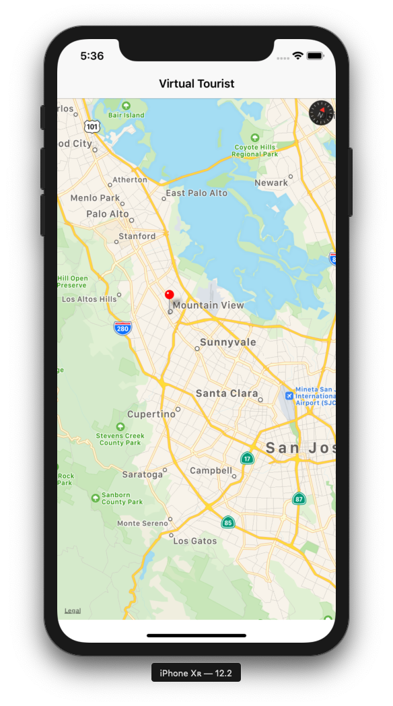
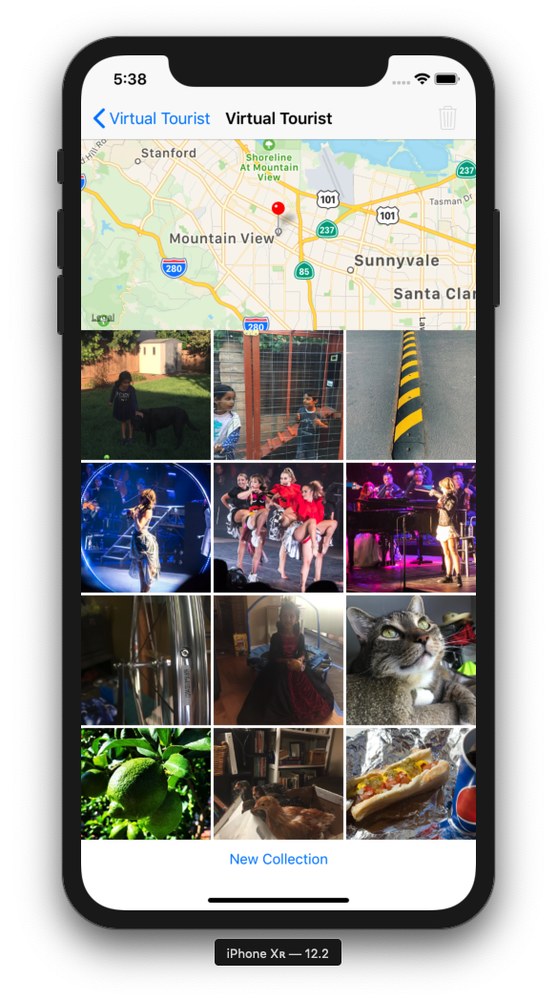
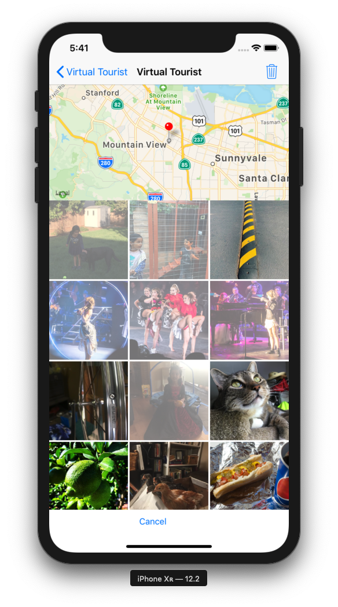
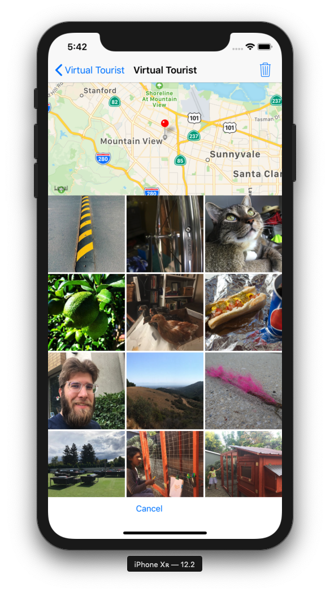
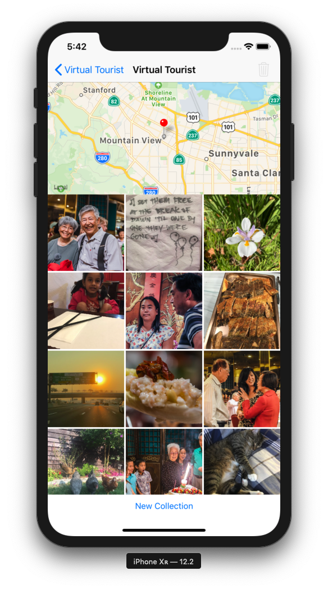

# Udacity iOS Developer Nanodegree - VirtualTourist App
This repository contains the VirtualTourist app from Udacity's Data Persistence course. This app connects to a public RESTful API, Flickr, to download photos and utilizes Core Data to save user pins and photos. Core Data is also used to persist the user's most recent map interaction so the user will be presented with the same map upon starting the app.

## Overview
Upon opening VirtualTourist, the user is presented with a map. If this is the user's first time on the app, the user will be presented with a default map. Otherwise, the user will be presented with the same map details that the user had from their previous interaction with the app. To drop a new location pin, the user holds their finger on the location they desire until the pin drops. If the user had dropped pins previously, the user will be presented with these pins. To view photos of that location, the user simply taps on the pin. The user will be taken to a new screen with the pin centered on the map. Photos that appear are downloaded from Flickr and stored for faster access the next time the user selects that same pin.

 

The user is able to choose multiple photos to delete in the collection by performing a long press gesture to enable multiple selections. Selecting photos highlights the image in white and deselecting photos will return the images to their normal color. The user can disable deletion by selecting cancel and the photos will return to their normal colors. When the user deletes photos, the photos below will move up to take their places. Additionally, the user can choose to delete the entire photo collection by pressing "New Collection" and be presented with a new photo collection.

  
